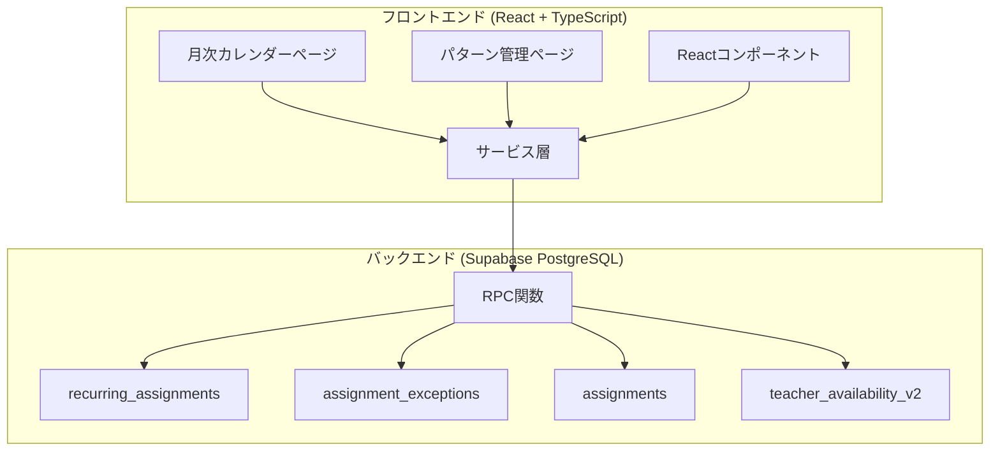
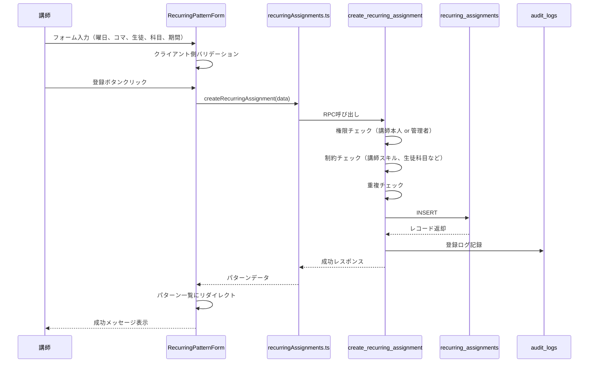
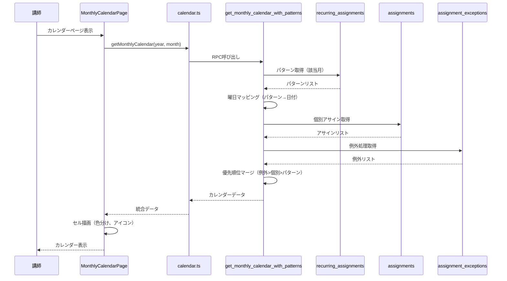
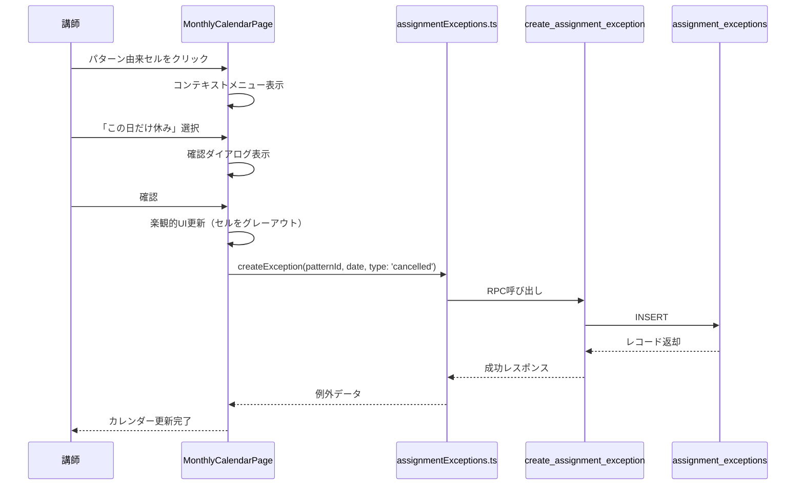
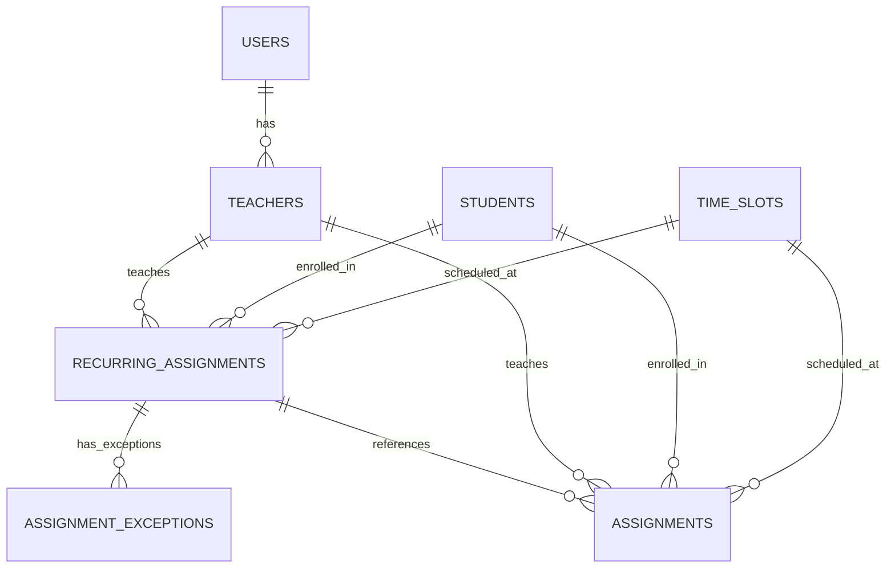
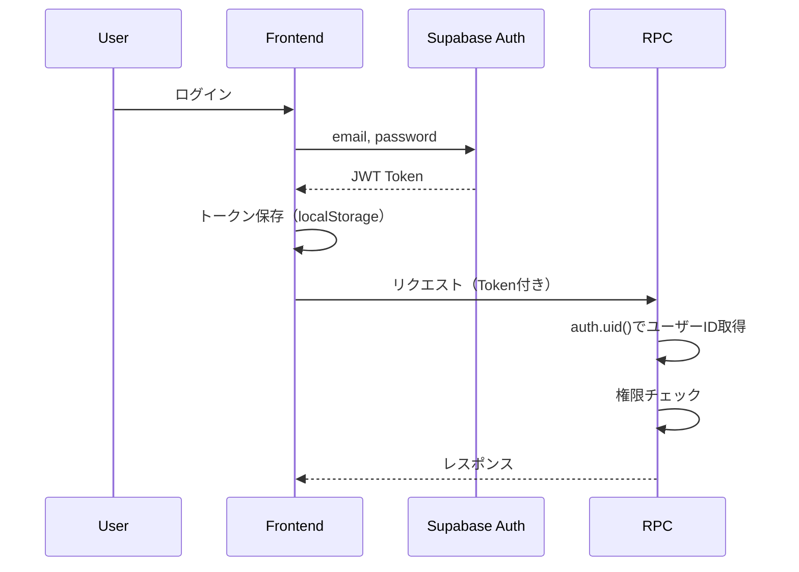
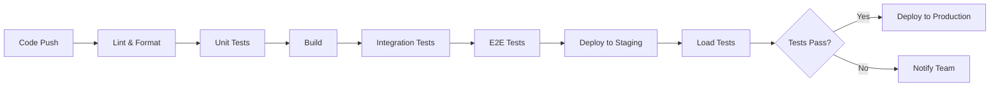

# 技術設計書

## 概要

定期授業パターンシステムは、曜日ベースの授業パターン（例：毎週月曜日コマA=田中くん数学）を登録し、月次カレンダーに自動展開する機能です。本設計書では、既存のV2システム（日付ベースのスケジューリング）に統合する形で実装します。

### 設計の目標

- **最小限の変更**: 既存システムへの影響を最小限に抑える
- **高いパフォーマンス**: 月次カレンダーの表示を1秒以内に完了
- **柔軟な例外処理**: 個別日付での休み・振替に対応
- **スケーラビリティ**: パターン数1000件、同時アクセス50名に対応

### 既存システムとの統合

本機能は以下の既存テーブル・システムと連携します：

- **V2システム**: `assignments`, `teacher_availability_v2`, `time_slots`
- **マスタデータ**: `teachers`, `students`, `users`
- **監査機能**: `audit_logs`

---

## 要件マッピング

### 設計コンポーネントとトレーサビリティ

各設計コンポーネントは特定の要件に対応しています：

| 設計コンポーネント | 対応要件 | 説明 |
|-------------------|---------|------|
| `recurring_assignments`テーブル | 要件1, 2, 3 | 定期パターンの登録・管理・自動展開 |
| `assignment_exceptions`テーブル | 要件4 | 個別日付での例外処理 |
| パターン展開ロジック | 要件3 | 月次カレンダーへの自動マッピング |
| RPC関数群 | 要件1, 2, 4, 6 | CRUD操作と権限管理 |
| フロントエンドコンポーネント | 要件8 | 直感的なUI/UX |
| セキュリティレイヤー | 要件6 | 講師は自分のパターンのみ管理 |
| 統合表示ロジック | 要件5 | パターンと個別アサインの優先順位制御 |

### ユーザーストーリーカバレッジ

- **要件1（パターン登録）**: `RecurringPatternForm` + `create_recurring_assignment` RPC
- **要件2（パターン管理）**: `RecurringPatternList` + `update/delete_recurring_assignment` RPC
- **要件3（自動展開）**: パターン展開アルゴリズム + 拡張版`get_monthly_calendar` RPC
- **要件4（例外処理）**: コンテキストメニュー + `assignment_exceptions`テーブル
- **要件5（統合表示）**: 優先順位ロジック + 色分け表示UI
- **要件6（権限管理）**: RLSポリシー + RPC内権限チェック
- **要件7（データ整合性）**: 外部キー制約 + バリデーション
- **要件8（UI/UX）**: React コンポーネント + 楽観的UI更新

---

## アーキテクチャ

### 高レベルアーキテクチャ



### 技術スタック

| レイヤー | 技術 | バージョン | 用途 |
|---------|------|----------|------|
| **フロントエンド** | React | 18.2.0 | UIライブラリ |
| | TypeScript | 5.3.3 | 型安全性 |
| | Styled Components | 6.3.9 | CSS-in-JS |
| | Redux Toolkit | 2.0.1 | 状態管理（一部） |
| **バックエンド** | Supabase | - | BaaS（PostgreSQL + Auth） |
| | PostgreSQL | 15+ | リレーショナルDB |
| | PL/pgSQL | - | RPC関数実装 |
| **ビルド** | Vite | 5.0.8 | ビルドツール |
| **テスト** | Vitest | 1.1.0 | ユニットテスト |

### アーキテクチャ決定の理由

#### なぜReact？
- 既存システムがReactで構築されている
- コンポーネントベースで保守性が高い
- TypeScriptとの相性が良い

#### なぜPostgreSQL（Supabase）？
- 既存システムで使用中
- RLSによる強力な権限管理
- JSONB型による柔軟なデータ保存

#### なぜRPC関数？
- 複雑なビジネスロジックをバックエンドに集約
- トランザクションの一貫性を保証
- セキュリティ（SQLインジェクション防止）

#### なぜStyled Components？
- 既存システムで使用中
- CSS-in-JSによるスコープ化
- 動的スタイリングが容易

---

## データフロー

### 主要ユーザーフロー

#### フロー1: 定期パターン登録



#### フロー2: 月次カレンダー表示（パターン展開）



#### フロー3: 例外処理（この日だけ休み）



---

## コンポーネントとインターフェース

### バックエンドサービス（RPC関数）

#### 1. create_recurring_assignment

```sql
CREATE OR REPLACE FUNCTION create_recurring_assignment(
  p_teacher_id UUID,
  p_day_of_week INTEGER,    -- 0=日曜, 1=月曜, ..., 6=土曜
  p_time_slot_id VARCHAR(10),
  p_student_id UUID,
  p_subject VARCHAR(50),
  p_start_date DATE,
  p_end_date DATE DEFAULT NULL,
  p_active BOOLEAN DEFAULT TRUE
) RETURNS recurring_assignments
LANGUAGE plpgsql SECURITY DEFINER
```

**処理内容**:
1. 権限チェック（講師本人 or 管理者）
2. 制約チェック（講師スキル、生徒科目、時間帯の有効性）
3. 重複チェック（同じ組み合わせの既存パターン）
4. INSERT実行
5. 監査ログ記録

#### 2. update_recurring_assignment

```sql
CREATE OR REPLACE FUNCTION update_recurring_assignment(
  p_pattern_id UUID,
  p_student_id UUID DEFAULT NULL,
  p_subject VARCHAR(50) DEFAULT NULL,
  p_end_date DATE DEFAULT NULL,
  p_active BOOLEAN DEFAULT NULL
) RETURNS recurring_assignments
LANGUAGE plpgsql SECURITY DEFINER
```

**処理内容**:
1. 権限チェック
2. 存在確認
3. バリデーション（変更後のデータ）
4. UPDATE実行
5. 監査ログ記録

#### 3. delete_recurring_assignment

```sql
CREATE OR REPLACE FUNCTION delete_recurring_assignment(
  p_pattern_id UUID
) RETURNS BOOLEAN
LANGUAGE plpgsql SECURITY DEFINER
```

**処理内容**:
1. 権限チェック
2. 例外レコードの削除（CASCADE）
3. パターン削除（個別アサインは保持）
4. 監査ログ記録

#### 4. list_recurring_assignments

```sql
CREATE OR REPLACE FUNCTION list_recurring_assignments(
  p_teacher_id UUID DEFAULT NULL,  -- NULLなら全件（管理者用）
  p_active_only BOOLEAN DEFAULT TRUE
) RETURNS TABLE (...)
LANGUAGE plpgsql SECURITY DEFINER
```

**処理内容**:
1. 権限チェック（講師は自分のパターンのみ）
2. フィルタリング（teacher_id, active）
3. JOIN（teacher, student情報）
4. ORDER BY (day_of_week, time_slot_id)

#### 5. get_monthly_calendar_with_patterns

```sql
CREATE OR REPLACE FUNCTION get_monthly_calendar_with_patterns(
  p_year INTEGER,
  p_month INTEGER,
  p_teacher_id UUID DEFAULT NULL
) RETURNS TABLE (
  date DATE,
  time_slot_id VARCHAR(10),
  teacher_id UUID,
  teacher_name VARCHAR(100),
  data_source VARCHAR(20),  -- 'pattern', 'assignment', 'exception'
  is_available BOOLEAN,
  student_id UUID,
  student_name VARCHAR(100),
  student_grade INTEGER,
  subject VARCHAR(50),
  position INTEGER,
  pattern_id UUID,
  exception_type VARCHAR(20)
)
LANGUAGE plpgsql SECURITY DEFINER
```

**処理内容**:
1. 月の日付範囲を計算
2. パターンを曜日→日付にマッピング
3. 個別アサインを取得
4. 例外処理を取得
5. 優先順位でマージ（例外 > 個別 > パターン）
6. teacher_idでフィルタ（指定時）

#### 6. create_assignment_exception

```sql
CREATE OR REPLACE FUNCTION create_assignment_exception(
  p_pattern_id UUID,
  p_date DATE,
  p_exception_type VARCHAR(20)  -- 'cancelled', 'modified'
) RETURNS assignment_exceptions
LANGUAGE plpgsql SECURITY DEFINER
```

**処理内容**:
1. 権限チェック
2. パターン存在確認
3. 重複チェック
4. INSERT実行
5. 監査ログ記録

### フロントエンドサービス層

#### `/src/services/recurringAssignments.ts`

```typescript
export interface RecurringAssignmentInput {
  teacherId: string
  dayOfWeek: number  // 0-6
  timeSlotId: string
  studentId: string
  subject: string
  startDate: string  // YYYY-MM-DD
  endDate?: string | null
  active?: boolean
}

export interface RecurringAssignment {
  id: string
  teacherId: string
  dayOfWeek: number
  timeSlotId: string
  studentId: string
  subject: string
  startDate: string
  endDate: string | null
  active: boolean
  createdAt: string
  updatedAt: string
  // Relations
  teacher?: Teacher
  student?: Student
  timeSlot?: TimeSlot
}

export async function createRecurringAssignment(
  data: RecurringAssignmentInput
): Promise<RecurringAssignment>

export async function updateRecurringAssignment(
  patternId: string,
  data: Partial<RecurringAssignmentInput>
): Promise<RecurringAssignment>

export async function deleteRecurringAssignment(
  patternId: string
): Promise<void>

export async function listRecurringAssignments(
  teacherId?: string,
  activeOnly?: boolean
): Promise<RecurringAssignment[]>
```

#### `/src/services/assignmentExceptions.ts`

```typescript
export interface AssignmentException {
  id: string
  patternId: string
  date: string
  exceptionType: 'cancelled' | 'modified'
  createdAt: string
  // Relations
  pattern?: RecurringAssignment
}

export async function createException(
  patternId: string,
  date: string,
  type: 'cancelled' | 'modified'
): Promise<AssignmentException>

export async function deleteException(
  exceptionId: string
): Promise<void>
```

### フロントエンドコンポーネント

#### コンポーネント一覧

| コンポーネント | 責務 | 主要Props/State |
|---------------|------|----------------|
| `RecurringPatternForm` | パターン登録・編集フォーム | `initialData?`, `onSubmit`, `onCancel` |
| `RecurringPatternList` | パターン一覧表示 | `teacherId?`, `onEdit`, `onDelete` |
| `RecurringPatternModal` | パターン登録・編集モーダル | `isOpen`, `pattern?`, `onClose` |
| `MonthlyCalendarPage`（拡張） | カレンダー表示 + パターン表示 | `year`, `month`, `teacherId` |
| `CalendarCell`（拡張） | セル表示 + コンテキストメニュー | `data`, `onException`, `onEdit` |

#### RecurringPatternForm

```typescript
interface RecurringPatternFormProps {
  initialData?: RecurringAssignment
  teacherId?: string  // 講師ロールの場合は自動設定
  onSubmit: (data: RecurringAssignmentInput) => Promise<void>
  onCancel: () => void
}

export const RecurringPatternForm: React.FC<RecurringPatternFormProps>
```

**実装詳細**:
- 曜日選択: ボタングループ（日〜土）
- コマ選択: ドロップダウン（1, A, B, C）
- 生徒選択: オートコンプリート付きドロップダウン
- 科目選択: 生徒の受講科目から自動フィルタ
- 期間設定: カレンダーピッカー
- バリデーション: React Hook Form + Zod

#### RecurringPatternList

```typescript
interface RecurringPatternListProps {
  teacherId?: string  // 指定時は該当講師のパターンのみ
  onEdit: (pattern: RecurringAssignment) => void
  onDelete: (pattern: RecurringAssignment) => void
}

export const RecurringPatternList: React.FC<RecurringPatternListProps>
```

**実装詳細**:
- ソート: 曜日、コマ、生徒名
- 検索: 生徒名、講師名
- フィルタ: 曜日、コマ、状態
- 一括操作: 複数選択 + 一括削除/無効化

#### MonthlyCalendarPage拡張

```typescript
// 既存のMonthlyCalendarPageに以下を追加

interface ExtendedCalendarData extends MonthlyCalendarData {
  dataSource: 'pattern' | 'assignment' | 'exception'
  patternId?: string
  exceptionType?: 'cancelled' | 'modified'
}

// 新しいstate
const [showPatterns, setShowPatterns] = useState(true)  // パターン表示ON/OFF
const [selectedPattern, setSelectedPattern] = useState<RecurringAssignment | null>(null)
```

**拡張UI要素**:
- 「パターン管理」ボタン
- 「新規パターン」ボタン
- 「モード切替」トグル（パターン表示ON/OFF）
- セルの色分け（青=パターン、緑=個別、グレー=例外）
- セルのアイコン（P=パターン、I=個別）
- コンテキストメニュー（右クリック or 長押し）

---

## データモデル

### ドメインエンティティ

1. **RecurringAssignment**: 定期授業パターン
2. **AssignmentException**: パターンの例外処理
3. **ExtendedMonthlyCalendarData**: パターン情報を含むカレンダーデータ

### エンティティリレーションシップ図



### データベーススキーマ

#### recurring_assignments

```sql
CREATE TABLE recurring_assignments (
    id UUID PRIMARY KEY DEFAULT gen_random_uuid(),
    teacher_id UUID NOT NULL REFERENCES teachers(id) ON DELETE CASCADE,
    day_of_week INTEGER NOT NULL CHECK (day_of_week >= 0 AND day_of_week <= 6),
    time_slot_id VARCHAR(10) NOT NULL REFERENCES time_slots(id),
    student_id UUID NOT NULL REFERENCES students(id) ON DELETE CASCADE,
    subject VARCHAR(50) NOT NULL,
    start_date DATE NOT NULL,
    end_date DATE,
    active BOOLEAN NOT NULL DEFAULT TRUE,
    created_at TIMESTAMP NOT NULL DEFAULT CURRENT_TIMESTAMP,
    updated_at TIMESTAMP NOT NULL DEFAULT CURRENT_TIMESTAMP,
    created_by UUID NOT NULL REFERENCES users(id),

    -- 同じ曜日・コマ・講師・生徒の組み合わせは一意
    UNIQUE(teacher_id, day_of_week, time_slot_id, student_id, start_date),

    -- 終了日は開始日以降
    CHECK (end_date IS NULL OR end_date >= start_date)
);

-- インデックス
CREATE INDEX idx_recurring_assignments_teacher ON recurring_assignments(teacher_id);
CREATE INDEX idx_recurring_assignments_student ON recurring_assignments(student_id);
CREATE INDEX idx_recurring_assignments_day_slot ON recurring_assignments(day_of_week, time_slot_id);
CREATE INDEX idx_recurring_assignments_active ON recurring_assignments(active) WHERE active = TRUE;
CREATE INDEX idx_recurring_assignments_dates ON recurring_assignments(start_date, end_date);
```

#### assignment_exceptions

```sql
CREATE TABLE assignment_exceptions (
    id UUID PRIMARY KEY DEFAULT gen_random_uuid(),
    pattern_id UUID NOT NULL REFERENCES recurring_assignments(id) ON DELETE CASCADE,
    date DATE NOT NULL,
    exception_type VARCHAR(20) NOT NULL CHECK (exception_type IN ('cancelled', 'modified')),
    created_at TIMESTAMP NOT NULL DEFAULT CURRENT_TIMESTAMP,
    created_by UUID NOT NULL REFERENCES users(id),

    -- 同じパターン・日付の例外は一意
    UNIQUE(pattern_id, date)
);

-- インデックス
CREATE INDEX idx_assignment_exceptions_pattern ON assignment_exceptions(pattern_id);
CREATE INDEX idx_assignment_exceptions_date ON assignment_exceptions(date);
```

### TypeScript型定義

```typescript
// src/types/entities.ts に追加

export interface RecurringAssignment {
  id: string
  teacherId: string
  dayOfWeek: number  // 0=日曜, 1=月曜, ..., 6=土曜
  timeSlotId: string
  studentId: string
  subject: string
  startDate: string
  endDate: string | null
  active: boolean
  createdAt: string
  updatedAt: string
  createdBy: string
  // Relations
  teacher?: Teacher
  student?: Student
  timeSlot?: TimeSlot
  createdByUser?: User
}

export interface AssignmentException {
  id: string
  patternId: string
  date: string
  exceptionType: 'cancelled' | 'modified'
  createdAt: string
  createdBy: string
  // Relations
  pattern?: RecurringAssignment
  createdByUser?: User
}

export interface ExtendedMonthlyCalendarData extends MonthlyCalendarData {
  dataSource: 'pattern' | 'assignment' | 'exception'
  patternId?: string | null
  exceptionType?: 'cancelled' | 'modified' | null
}
```

### マイグレーション戦略

#### マイグレーションファイルの順序

1. `YYYYMMDDHHMMSS_create_recurring_assignments.sql`
   - `recurring_assignments`テーブル作成
   - インデックス作成

2. `YYYYMMDDHHMMSS_create_assignment_exceptions.sql`
   - `assignment_exceptions`テーブル作成
   - インデックス作成

3. `YYYYMMDDHHMMSS_recurring_assignment_rpc_functions.sql`
   - RPC関数の作成

4. `YYYYMMDDHHMMSS_recurring_assignment_rls_policies.sql`
   - RLSポリシーの設定

#### 後方互換性

- 既存のテーブルには影響を与えない（新規テーブルのみ）
- 既存の`get_monthly_calendar`関数は維持
- 新しい`get_monthly_calendar_with_patterns`関数を追加
- フロントエンドは段階的に移行可能

#### インデックス戦略

**パフォーマンス最適化のためのインデックス**:
- `teacher_id`: 講師ごとのパターン一覧で使用
- `day_of_week, time_slot_id`: パターン展開時のフィルタリング
- `active`: 有効なパターンのみ取得
- `start_date, end_date`: 日付範囲フィルタリング

---

## エラーハンドリング

### エラー分類

#### クライアント側エラー（400番台）

| エラーコード | メッセージ | 対応 |
|------------|-----------|------|
| `VALIDATION_ERROR` | 入力値が不正です | フォーム再入力を促す |
| `DUPLICATE_PATTERN` | この組み合わせは既に登録されています | 既存パターンを表示 |
| `PERMISSION_DENIED` | 権限がありません | ログイン画面へリダイレクト |
| `RESOURCE_NOT_FOUND` | パターンが見つかりません | 一覧画面へリダイレクト |

#### サーバー側エラー（500番台）

| エラーコード | メッセージ | 対応 |
|------------|-----------|------|
| `DATABASE_ERROR` | データベースエラーが発生しました | リトライボタン表示 |
| `RPC_ERROR` | サーバー処理エラーが発生しました | エラー詳細をログに記録 |

### エラーハンドリング戦略

#### フロントエンド

```typescript
try {
  await createRecurringAssignment(data)
  toast.success('パターンを登録しました')
  navigate('/patterns')
} catch (error) {
  if (error.code === 'DUPLICATE_PATTERN') {
    toast.error('この組み合わせは既に登録されています')
  } else if (error.code === 'PERMISSION_DENIED') {
    toast.error('権限がありません')
    navigate('/login')
  } else {
    toast.error('エラーが発生しました。もう一度お試しください。')
    console.error(error)
  }
}
```

#### バックエンド（RPC関数）

```sql
BEGIN
  -- 権限チェック
  IF NOT has_permission(v_actor_id, p_teacher_id) THEN
    RAISE EXCEPTION 'PERMISSION_DENIED: 権限がありません'
      USING HINT = 'You can only manage your own patterns';
  END IF;

  -- 重複チェック
  IF EXISTS (...) THEN
    RAISE EXCEPTION 'DUPLICATE_PATTERN: この組み合わせは既に登録されています'
      USING HINT = 'Pattern already exists';
  END IF;

  -- 処理実行
  ...

  RETURN result;

EXCEPTION
  WHEN OTHERS THEN
    -- ログ記録
    INSERT INTO error_logs (error_message, error_detail) VALUES (SQLERRM, SQLSTATE);
    RAISE;
END;
```

---

## セキュリティ考慮事項

### 認証と認可

#### 認証フロー



#### 認可マトリックス

| ロール | パターン作成 | 自分のパターン編集 | 他講師のパターン編集 | パターン削除 | 閲覧 |
|-------|------------|-----------------|------------------|------------|------|
| admin | ✅ | ✅ | ✅ | ✅ | ✅全て |
| teacher | ✅ | ✅ | ❌ | ✅自分のみ | ✅自分のみ |
| viewer | ❌ | ❌ | ❌ | ❌ | ✅全て |

#### RLSポリシー

```sql
-- recurring_assignments のRLSポリシー
ALTER TABLE recurring_assignments ENABLE ROW LEVEL SECURITY;

-- SELECT: 管理者は全て、講師は自分のパターンのみ、viewerは全て閲覧可能
CREATE POLICY recurring_assignments_select_policy ON recurring_assignments
  FOR SELECT
  USING (
    EXISTS (
      SELECT 1 FROM users
      WHERE users.id = auth.uid()
        AND (
          users.role = 'admin'
          OR users.role = 'viewer'
          OR (users.role = 'teacher' AND recurring_assignments.teacher_id IN (
            SELECT id FROM teachers WHERE user_id = auth.uid()
          ))
        )
    )
  );

-- INSERT: 管理者と講師のみ（講師は自分のパターンのみ）
CREATE POLICY recurring_assignments_insert_policy ON recurring_assignments
  FOR INSERT
  WITH CHECK (
    EXISTS (
      SELECT 1 FROM users
      WHERE users.id = auth.uid()
        AND (
          users.role = 'admin'
          OR (users.role = 'teacher' AND teacher_id IN (
            SELECT id FROM teachers WHERE user_id = auth.uid()
          ))
        )
    )
  );

-- UPDATE: 管理者は全て、講師は自分のパターンのみ
CREATE POLICY recurring_assignments_update_policy ON recurring_assignments
  FOR UPDATE
  USING (
    EXISTS (
      SELECT 1 FROM users
      WHERE users.id = auth.uid()
        AND (
          users.role = 'admin'
          OR (users.role = 'teacher' AND recurring_assignments.teacher_id IN (
            SELECT id FROM teachers WHERE user_id = auth.uid()
          ))
        )
    )
  );

-- DELETE: 管理者は全て、講師は自分のパターンのみ
CREATE POLICY recurring_assignments_delete_policy ON recurring_assignments
  FOR DELETE
  USING (
    EXISTS (
      SELECT 1 FROM users
      WHERE users.id = auth.uid()
        AND (
          users.role = 'admin'
          OR (users.role = 'teacher' AND recurring_assignments.teacher_id IN (
            SELECT id FROM teachers WHERE user_id = auth.uid()
          ))
        )
    )
  );
```

### データ保護

#### 入力バリデーション

**フロントエンド（Zod）**:
```typescript
const recurringAssignmentSchema = z.object({
  teacherId: z.string().uuid(),
  dayOfWeek: z.number().int().min(0).max(6),
  timeSlotId: z.string().regex(/^[01ABC]$/),
  studentId: z.string().uuid(),
  subject: z.string().min(1).max(50),
  startDate: z.string().regex(/^\d{4}-\d{2}-\d{2}$/),
  endDate: z.string().regex(/^\d{4}-\d{2}-\d{2}$/).nullable().optional(),
  active: z.boolean().optional(),
})
```

**バックエンド（RPC関数内）**:
- UUID形式チェック
- 日付形式チェック
- 外部キー存在確認
- ビジネスルールバリデーション

#### SQLインジェクション対策

- RPC関数のパラメータ化されたクエリを使用
- ユーザー入力を直接SQL文字列に連結しない
- Supabaseクライアントライブラリの安全なAPI使用

#### XSS対策

- Reactの自動エスケープ機能を活用
- `dangerouslySetInnerHTML`の使用を避ける
- ユーザー入力をそのままレンダリングしない

### セキュリティベストプラクティス

#### OWASP Top 10対策

1. **Injection**: パラメータ化クエリ、入力バリデーション
2. **Broken Authentication**: Supabase Authの使用、JWT検証
3. **Sensitive Data Exposure**: HTTPSのみ、パスワードハッシュ化
4. **XML External Entities (XXE)**: 該当なし（JSONのみ使用）
5. **Broken Access Control**: RLSポリシー、RPC内権限チェック
6. **Security Misconfiguration**: 環境変数管理、最小権限の原則
7. **Cross-Site Scripting (XSS)**: Reactの自動エスケープ
8. **Insecure Deserialization**: 信頼できるソースからのデータのみ
9. **Using Components with Known Vulnerabilities**: 定期的な依存関係更新
10. **Insufficient Logging & Monitoring**: 監査ログ、エラーログ

#### APIレート制限

Supabaseの組み込みレート制限を使用：
- 認証済みユーザー: 100 req/min
- 匿名ユーザー: 制限なし（認証必須のため該当なし）

#### CORSポリシー

Supabaseプロジェクト設定で許可オリジンを設定：
- 本番: `https://komafit.example.com`
- 開発: `http://localhost:3000`

---

## パフォーマンスとスケーラビリティ

### パフォーマンス目標

| メトリック | 目標値 | 測定方法 |
|-----------|--------|----------|
| 月次カレンダー表示（p95） | < 1秒 | ブラウザDevToolsのNetwork |
| 月次カレンダー表示（p99） | < 2秒 | 同上 |
| パターン登録（p95） | < 500ms | 同上 |
| パターン一覧表示（100件） | < 1秒 | 同上 |
| 同時アクセス | 50名 | 負荷テスト |
| データ件数 | パターン1000件 | ベンチマーク |

### キャッシング戦略

#### ブラウザキャッシュ

- **静的アセット**: `Cache-Control: public, max-age=31536000, immutable`
- **APIレスポンス**: キャッシュしない（動的データのため）

#### アプリケーションキャッシュ

```typescript
// React QueryでAPIレスポンスをキャッシュ
const { data: patterns } = useQuery({
  queryKey: ['recurring-patterns', teacherId],
  queryFn: () => listRecurringAssignments(teacherId),
  staleTime: 5 * 60 * 1000,  // 5分間はキャッシュを使用
  cacheTime: 10 * 60 * 1000, // 10分間キャッシュを保持
})
```

#### データベースクエリキャッシュ

PostgreSQLの組み込みキャッシュを活用：
- 頻繁にアクセスされるテーブルは自動的にメモリキャッシュ
- インデックスもメモリキャッシュ

### スケーラビリティアプローチ

#### 水平スケーリング

- **フロントエンド**: CDN（Vercel Edge Network）で配信
- **Supabase**: Auto-scalingプラン使用

#### 読み取りレプリカ

- パターン一覧など読み取り専用クエリは読み取りレプリカを使用
- Supabaseのread replicaオプション（将来的に）

#### バックグラウンドジョブ

現時点では不要（パターン展開はリアルタイム）

将来的に必要になる場合：
- Supabase Edge Functionsでcron job
- 大量パターンの一括処理

### データベース最適化

#### クエリ最適化

```sql
-- EXPLAIN ANALYZEで実行計画を確認
EXPLAIN ANALYZE
SELECT * FROM recurring_assignments
WHERE teacher_id = 'xxx'
  AND active = TRUE
  AND day_of_week = 1;

-- 複合インデックスの活用
CREATE INDEX idx_recurring_assignments_teacher_active_day
  ON recurring_assignments(teacher_id, active, day_of_week)
  WHERE active = TRUE;
```

#### N+1問題の回避

```typescript
// 悪い例（N+1）
const patterns = await listRecurringAssignments()
for (const pattern of patterns) {
  const teacher = await getTeacher(pattern.teacherId)  // N回の追加クエリ
  const student = await getStudent(pattern.studentId)  // N回の追加クエリ}

// 良い例（JOIN）
const patterns = await supabase
  .from('recurring_assignments')
  .select('*, teacher:teachers(*), student:students(*)')  // 1回のクエリ
```

---

## テスト戦略

### テストカバレッジ要件

| レイヤー | 目標カバレッジ | 対象 |
|---------|--------------|------|
| ユニットテスト | ≥80% | サービス層、ユーティリティ関数 |
| 統合テスト | 全APIエンドポイント | RPC関数、データベース操作 |
| E2Eテスト | 主要ユーザーフロー | パターン登録、カレンダー表示 |

### テストアプローチ

#### 1. ユニットテスト（Vitest）

**テスト対象**:
- サービス層関数（`recurringAssignments.ts`, `assignmentExceptions.ts`）
- ユーティリティ関数（日付計算、曜日マッピングなど）
- Reactコンポーネント（React Testing Library）

**テスト例**:
```typescript
// src/services/__tests__/recurringAssignments.test.ts
import { describe, it, expect, vi } from 'vitest'
import { createRecurringAssignment } from '../recurringAssignments'

describe('createRecurringAssignment', () => {
  it('should create a recurring pattern with valid data', async () => {
    const mockRpc = vi.fn().mockResolvedValue({ data: mockPattern, error: null })
    vi.spyOn(supabase, 'rpc').mockImplementation(mockRpc)

    const result = await createRecurringAssignment({
      teacherId: 'teacher-1',
      dayOfWeek: 1,  // Monday
      timeSlotId: 'A',
      studentId: 'student-1',
      subject: '数学',
      startDate: '2026-02-01',
    })

    expect(mockRpc).toHaveBeenCalledWith('create_recurring_assignment', expect.any(Object))
    expect(result.id).toBeDefined()
  })

  it('should throw error for duplicate pattern', async () => {
    const mockError = { code: 'DUPLICATE_PATTERN', message: 'Pattern exists' }
    vi.spyOn(supabase, 'rpc').mockResolvedValue({ data: null, error: mockError })

    await expect(createRecurringAssignment({...})).rejects.toThrow('Pattern exists')
  })
})
```

#### 2. 統合テスト（Vitest + Supabase Local）

**テスト対象**:
- RPC関数の動作
- データベース制約
- トランザクション整合性

**テスト例**:
```typescript
// supabase/__tests__/rpc/recurring_assignments.test.ts
import { describe, it, expect, beforeAll, afterAll } from 'vitest'
import { createClient } from '@supabase/supabase-js'

describe('create_recurring_assignment RPC', () => {
  let supabase: SupabaseClient

  beforeAll(async () => {
    supabase = createClient(process.env.SUPABASE_URL, process.env.SUPABASE_ANON_KEY)
    // テストデータ準備
    await setupTestData()
  })

  afterAll(async () => {
    await cleanupTestData()
  })

  it('should create pattern and record audit log', async () => {
    const { data, error } = await supabase.rpc('create_recurring_assignment', {
      p_teacher_id: testTeacherId,
      p_day_of_week: 1,
      p_time_slot_id: 'A',
      p_student_id: testStudentId,
      p_subject: '数学',
      p_start_date: '2026-02-01',
    })

    expect(error).toBeNull()
    expect(data.id).toBeDefined()

    // 監査ログ確認
    const { data: logs } = await supabase
      .from('audit_logs')
      .select('*')
      .eq('action', 'RECURRING_PATTERN_CREATE')
      .order('created_at', { ascending: false })
      .limit(1)

    expect(logs[0].payload.pattern_id).toBe(data.id)
  })
})
```

#### 3. E2Eテスト（Playwright）

**テスト対象**:
- パターン登録フロー
- 月次カレンダー表示
- 例外処理操作

**テスト例**:
```typescript
// tests/e2e/recurring-patterns.spec.ts
import { test, expect } from '@playwright/test'

test('should create recurring pattern and display in calendar', async ({ page }) => {
  // ログイン
  await page.goto('/login')
  await page.fill('input[name="email"]', 'teacher@example.com')
  await page.fill('input[name="password"]', 'password')
  await page.click('button[type="submit"]')

  // パターン管理ページへ
  await page.click('text=パターン管理')

  // 新規パターン作成
  await page.click('text=新規パターン')
  await page.click('button[data-day="1"]')  // 月曜日
  await page.selectOption('select[name="timeSlotId"]', 'A')
  await page.fill('input[name="student"]', '田中')
  await page.click('text=田中太郎')  // オートコンプリート
  await page.selectOption('select[name="subject"]', '数学')
  await page.fill('input[name="startDate"]', '2026-02-01')
  await page.click('button:has-text("登録")')

  // 成功メッセージ確認
  await expect(page.locator('text=パターンを登録しました')).toBeVisible()

  // 月次カレンダーで確認
  await page.click('text=月次カレンダー')
  const cell = page.locator('[data-date="2026-02-02"][data-slot="A"]')  // 2026-02-02は月曜日
  await expect(cell).toHaveCSS('background-color', /rgb\(227, 242, 253\)/)  // 青系
  await expect(cell.locator('text=田中太郎')).toBeVisible()
  await expect(cell.locator('text=数学')).toBeVisible()
})
```

#### 4. パフォーマンステスト（k6）

**テスト例**:
```javascript
// tests/load/monthly-calendar.js
import http from 'k6/http'
import { check, sleep } from 'k6'

export const options = {
  stages: [
    { duration: '1m', target: 10 },   // 1分で10ユーザーまで増加
    { duration: '3m', target: 50 },   // 3分で50ユーザーまで増加
    { duration: '1m', target: 0 },    // 1分で0まで減少
  ],
  thresholds: {
    http_req_duration: ['p(95)<1000'], // 95%のリクエストが1秒以内
  },
}

export default function () {
  const res = http.post(
    `${__ENV.SUPABASE_URL}/rest/v1/rpc/get_monthly_calendar_with_patterns`,
    JSON.stringify({
      p_year: 2026,
      p_month: 2,
      p_teacher_id: 'teacher-1',
    }),
    {
      headers: {
        'Content-Type': 'application/json',
        'apikey': __ENV.SUPABASE_ANON_KEY,
        'Authorization': `Bearer ${__ENV.TEST_TOKEN}`,
      },
    }
  )

  check(res, {
    'status is 200': (r) => r.status === 200,
    'response time < 1s': (r) => r.timings.duration < 1000,
    'has calendar data': (r) => JSON.parse(r.body).length > 0,
  })

  sleep(1)
}
```

### CI/CDパイプライン



**GitHub Actions設定**:
```yaml
name: CI/CD Pipeline

on: [push, pull_request]

jobs:
  test:
    runs-on: ubuntu-latest
    steps:
      - uses: actions/checkout@v3
      - uses: actions/setup-node@v3
        with:
          node-version: '18'

      - name: Install dependencies
        run: npm ci

      - name: Lint
        run: npm run lint

      - name: Unit tests
        run: npm run test

      - name: Build
        run: npm run build

      - name: E2E tests
        run: npx playwright test

      - name: Deploy to staging
        if: github.ref == 'refs/heads/main'
        run: npm run deploy:staging

      - name: Load tests
        if: github.ref == 'refs/heads/main'
        run: k6 run tests/load/monthly-calendar.js
```

---

## 実装計画

### フェーズ1: データベースとRPC関数（週1）

- [ ] マイグレーションファイル作成
- [ ] テーブル作成（recurring_assignments, assignment_exceptions）
- [ ] RPC関数実装（create, update, delete, list）
- [ ] RLSポリシー設定
- [ ] 統合テスト作成

### フェーズ2: フロントエンドサービス層（週1-2）

- [ ] 型定義追加（RecurringAssignment, AssignmentException）
- [ ] サービス層実装（recurringAssignments.ts, assignmentExceptions.ts）
- [ ] ユニットテスト作成

### フェーズ3: UIコンポーネント（週2-3）

- [ ] RecurringPatternForm実装
- [ ] RecurringPatternList実装
- [ ] RecurringPatternModal実装
- [ ] MonthlyCalendarPage拡張（パターン表示）
- [ ] コンテキストメニュー実装
- [ ] E2Eテスト作成

### フェーズ4: 統合とテスト（週3-4）

- [ ] 全体統合テスト
- [ ] パフォーマンステスト
- [ ] バグ修正
- [ ] ドキュメント更新

---

**ステータス**: 技術設計完了
**次のステップ**: `/kiro:spec-tasks recurring-assignments` を実行して実装タスクを生成
